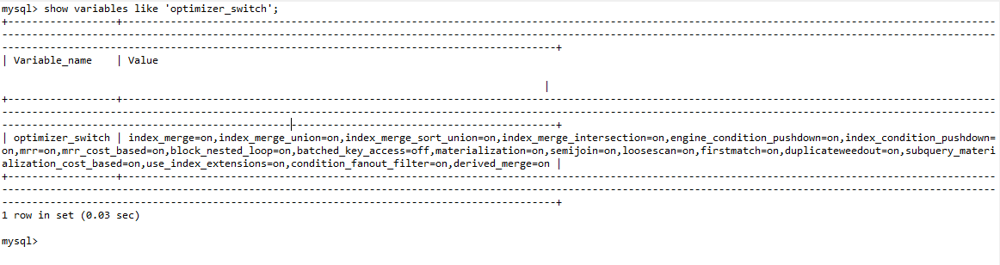

## MySQL优化-本人的MySQL调优学习笔记


结合我以前的项目经验，汇总了一下MySQL的调优方法如下。

## 一．SQL优化
### 1. 自动杀掉慢查询语句
使用参数max_statement_time控制SQL执行SQL执行时间(单位: 秒)。默认值0，表示不限制SQL执行时间。
```
举例：set global max_statement_time=1; #由MySQL自动杀死超过1s的慢查询语句。
```

### 2. 避免子查询
尽量不要编写子查询，虽然MySQL 5.6开始有内部的优化器将子查询改写为关联查询，但这个改写过程总有些开销。比如如下语句在5.5版本性能很差(5.5版本MySQL会先全表扫描外表，每条外表数据会传到内表与之关联，外表如果记录数多，性能就差)。
```mysql
Select CountryId, CountryName, Continent,Code from Country where Continent='Europe'and Country.Code in (select City.country from City where City,Population>1*1000*1000);
```
优化方法是改成半连接，如下所示。
```mysql
Select a. CountryId, a.CountryName, a.Continent,a.Code from Country a join (select City.country from City
Where City.Population>1*1000*1000) b on a.Code=b.Country where a.Continent='Europe';
```
注： 执行指令show variables like **'optimizer_switch'**; 可以查询优化器开关。半连接优化器默认开启。
注：半连接优化器仅对查询sql有效，对于update/delete的子查询仍旧需要人工修改。

### 3. 避免select *语句
这个不用多说，对于字段数多的表优化效果显著。

### 4. 派生子查询优化
从MySQL 5.6开始具备此内部优化器功能。
> 4.1 派生表合并优化<br/>
如下SQL有性能问题：
```mysql
SELECT * from (SELECT * FROM City WHERE Population>10*1000) as big_city WHERE big_city.Country='DEU'

```
在5.5版本中，会首先执行内表找出符合条件的记录并保存在临时表中，然后在临时表中过滤出哪些城市属于德国，这种重复性工作降低了性能。
优化后的SQL如下：
```mysql
SELECT * FROM City WHERE Country='DEU'AND Population>10*1000;
```
派生子查询优化器默认开启。
> 4.2 派生表索引优化<br/>
如果派生表不能合并到父表查询，则会把查询结果存放到一张临时表内，在5.5版本中的临时表是无法使用到索引的，只能全表扫描。从5.6版本开始，会自动生成索引至临时表再执行一个连接。可执行如下SQL语句测试：
```mysql
explain select * from sbtest a, (select sum(id) id from sbtest group by k) b where a.id=b.id and a.k=1;
```
查看执行结果，可以看到为子查询对应的临时表自动创建了索引。
MySQL 5.7遇到这一场景无需再人工优化SQL。

### 5. 避免IN语句
类似如下IN语句在MySQL 5.6以前版本是得不到优化的。
```mysql
Select * from sbtest where (id,k) in((11,0), (12,1), (13,2), (14,3), (15,4));
```
即使在字段id,k 上建立了索引，但是执行后仍然是全表扫描。
优化后的语句如下：
```mysql
Select * from sbtest where (id=11 and k=0) or (id=12 and k=1) or (id=13 and k=2) or (id=14 and k=3) or  (id=15 and k=4)
```

### 6. Delete/Update IN子句优化
in 子句同样可以用left join来代替，提升性能。
如下SQL:
```mysql
delete from t1 where t1.id in(select id from t2 where id<5);
```
可以优化为：
```mysql
delete from t1 join (select id from t2 where id<5) tmp on t1.id=tmp.id;
```
或者
```mysql
delete from t1 where exists(select t2.id from t2 where t2.id=t1.id and t2.id<5)
```

### 7. 模式匹配like '%xxx%'的优化
在MySQL中, like 'xxx%'子句可以用到索引，但'%xxx%'不行。除了使用[全文索引](http://172.16.9.14:8090/pages/viewpage.action?pageId=19989244)外，还可以用覆盖索引优化。
比如SQL: 
```mysql
select * from artist where name like '%king%';
```
其中artist.artist_id字段建立了主键(聚集索引), 从索引中能够取得artist_id列，不必读取数据行。如果select后的字段正好是索引，那么就用到了覆盖索引。通过覆盖索引，可以减少I/O, 提高性能。
优化后的代码如下：
```mysql
select * from artist a join (select artist_id from artist where name like '%king%') b on a.artist_id=b.artist_id.
```

### 8. Limit分页的优化
如下SQL:
```mysql
Select * from test1 order by id limit 99999,10;
```
以上SQL虽然用到了id索引，但是从第一行起要定位到99999行，再向后扫描10行，等于在做全表扫描，性能低下。
优化后的SQL如下：
```mysql
Select * from test1 order by id where id>=100000 order by id limit 10;
```
以上SQL利用id索引直接定位到第100000行，再向后扫描10行，相当于一个range范围扫描。性能提升不少。

### 9.	使用表内连接进行Limit分页的优化
如下SQL:
```mysql
Select id,title,createdate from test1 order by createdate asc limit 100000,10;
```
优化后的SQL:
```mysql
Select a.id, a.title,a.createdate from test1 a join (select id from test1 order by createdate asc limit 100000,1) b on a.id>=b.id limit 10;
```
优化的思路是先取出99999行后面的1条记录的id，再用表内连接的方法取出后面10条。

### 10.	注意查询字段类型匹配
如SQL:  
```mysql
Select * from sbtest where id = '1';
```
如果字段id为整型，且建立了索引，因为等号右边的值被识别为字符串类型，和字段类型不匹配，则上述语句走不到索引。正确的语句如下：
```mysql
Select * from sbtest where id=1.
```

### 11.	Union All优化
Mysql 5.7中， union all不再创建一张临时表，这在执行大的联合查询中会减少I/O开销，提升查询速度。但对union语句和在最外层使用order by的语句无效。
如下SQL不会产生临时表。
```mysql
(Select id from t1 order by id) union all (select id from sbtest where k=0 order by id);
```
但如下SQL会产生临时表。
```mysql
(Select id from t1 order by id) union (select id from sbtest where k=0 order by id);
(Select id from t1 order by id) union all (select id from sbtest where k=0 order by id) order by id desc;
```

### 12. Or子句优化
如下SQL: 
```mysql
Select * from city where category='A'or category='B'
```
虽然在category字段上加了索引，但走不到索引，可以用union all语句优化
```mysql
(Select * from city where category='A') union all (Select * from city where category='B' )
```

### 13. Count(*)优化
Count(辅助索引)性能优于count(*)
如下sql:
```mysql
Select count(*) from up_user
```
优化后的sql:
```mysql
Select count(*) from up_user where sid>=0;
```

### 14. ON DUPLICATE KEY UPDATE优化
MySQL有一种高效的主键冲突判断功能，即冲突时执行update, 不冲突时执行insert逻辑。如下所示：
```mysql
INSERT INTO up_relation(ownerId, contactId, isBuddy, isChatFriend, isBlackList) VALUES('001','CTS001',1,0,0) 
ON DUPLICATE KEY UPDATE IsBuddy=1, IsChatFriend=0
```
注：这种操作必须是基于主键或者唯一索引的操作。

### 15. 不必要的SQL子句
#### 15.1 不必要的order by子句
```mysql
Select count(1) as rs_count from a where a.content like 'rc%' order by a.title.
```
如上SQL只是做记录数统计，没有必要排序，去除order by 子句后性能会提升。
#### 15.2 不必要的嵌套select语句
```mysql
Select * from 
(select a.id, a.title, a.content,b.log_time,b.name FROM a,b where a.content LIKE 'rc%' AND a.d=b.d) as rs_table limit 0,30 
order by a.title desc;
```
如上SQL语句在子表的查询结果里再过滤出前30条记录，这样对性能是有消耗的。优化后的语句如下：
```mysql
Select a,id, a.title, a,content,b.log_time,b.name from a join b on a.id=b.id and a.content like 'rc%' order by a.title desc limit 0,30;

```
#### 15.3 不必要的表自身连接
```mysql
Select PL.pid, PL.request_date,PL.bean_total FROM paybean_success PL INNER JOIN 
(SELECT pid, MIN(request_date) request_date FROM paybean_success GROUP BY pid) PR
ON PL.pid=PR.pid AND PL.request_date=PR.request_date
```
如上SQL语句有不必要的自连接，查出来的记录冗余，优化后的语句如下：
```mysql
Select pid, MIN(request_date) request_date,bean_total FROM paybean_success GROUP BY pid
```

### 16.	避免使用having语句
Having子句只会在检索出所有记录后再执行一次过滤，这个处理需要排序，总计等操作，不建议使用。优化方法是通过where子句过滤记录数目，就能减少这方面的开销。
如下SQL:
```mysql
Select * from sbtest group by id having id>40 limit 3
```
优化后为
```mysql
Select * from sbtest where id>40 group by id limit 3
```
一般情况，having子句中的条件用于对一些集合函数的比较，如count()等，除此之外，都应该写在where子句中。

### 17.	合理使用索引
#### 17.1 联合索引替换单一索引
MySQL会根据where子句后的查询字段来判断最优使用哪个索引。如果有多个查询字段，则会优先使用联合索引。
#### 17.2 字段使用函数，将无法使用索引
避免where子句后加上函数。如下SQL性能不佳, 进行了全表扫描。
```mysql
Select create_time from aa where Date(create_time)>curdate()
```
优化后的语句如下：
```mysql
Select create_time from aa where create_time > DATE_FORMAT(curdate(), '%Y-%m-%d');
```
#### 17.3 取出数据量过大，将无法使用索引
当取出的记录量超过表中数据的20%， 优化器不会使用索引，而是全表扫描。
```mysql
Select count(id) from t1 where datetime >= '2018-03-15'and state=0;
```
如上SQL语句取出的数据量超过全表数据量20%， 优化器认为全表扫描比索引快。优化后的代码如下：
```mysql
Select count(id) from t1 where datetime between '2018-03-15 00:00:00'and '2018-03-16 23:59:59'and state=0;
```
#### 17.4 某些场景下不使用索引
当索引包含的是平均分布的数据集时，进行全表扫描比读取索引更快。比如数据表有个字段是性别，它有两个平均分布的值（男和女）。通过这两个值分别可以读取大约50%的记录，这种情况进行全表扫描更快，因此不适合在性别上建立索引。
#### 17.5 Orderby子句的索引优化
如下SQL
```mysql
Select * from t1 where pid=123456 order by change_date
```
其中pid已经建立了索引，而一条sql只能使用一个最优索引，因此在change_date上增加一个索引没有意义。优化的方法是在pid,change_date上建立联合索引。这样可以避免using firesort排序。
此外，order by子句后的字段顺序要一致，即要么全部升序，要么全部降序。

### 18. MRR优化
MySQL 5.6开始，增加了MRR(Multi-Range Read)功能, 如下SQL语句，优化器会先扫描索引，然后收集每行的主键，再对主键排序，然后用主键顺序访问基表，即用顺序I/O代替随机I/O.
```mysql
Select * from t1 where i2>2000 and i2 < 4000;
```
指令show variables like 'optimizer_switch' 可以查询优化器开关状态，如下图所示，默认mrr开关是开启的。
 

### 19. Index Merge优化
MySQL 5.6开始，如下语句可以使用索引合并, 假设在字段a和b上分别建立了索引。
```mysql
Select * from t where a=1 or b=10; 
```
注：如果查询条件里包含三个或三个以上索引则用不上索引合并优化。这一优化开关默认是开启的。

### 20. ICP优化
MySQL 5.6开始，提供了ICP(Index Condition Pushdown)功能, 如下SQL语句会激活此功能。
```mysql
Select * from student where class=1 and score>60;
```
以上SQL中，如果不开启ICP，首先会根据class=1来查找记录，检索的结果将指向聚集索引，最后根据score>60进行过滤，把最终结果返回给用户。
开启ICP后，在根据class=1查找记录的同时会根据score>60进行过滤，然后检索的结果指向聚集索引，最后返回给用户。ICP减少了存储引擎访问表的次数，从而提升性能。
注：这一优化开关默认是开启的。


## 二．MySQL5.7 配置参数优化
在配置文件my.cnf(windows下是my.ini)里修改如下参数。
### 21.	innodb_io_capacity
默认是200，单位是页，该参数的设置大小取决于硬盘的IOPS即每秒每秒的输入输出量(或读写次数)，此参数可以用来调整每秒刷新脏页的数量, 从而提升性能 。
如下表格所示为不同的磁盘配置建议的参数值。

|innodb_io_capacity|磁盘配置|
|:---:|:---:|
|200|单盘SAS/SATA
|2000|SAS*12， RAID 10
|5000|SSD
|50000|FUSION-IO

### 22.	innodb_buffer_pool_size
innodb缓存池大小，默认值 128mb, 远远不能满足生产需求。参数的设置要根据自己的实际情况来设置，如果设置的值不在合理的范围内，并不是设置越大越好，可能设置的数值太大体现不出优化效果，反而造成系统的swap空间被占用，导致操作系统变慢，降低sql查询性能。
这个参数和以下几个参数有关，附上官方解释。
* innodb_buffer_pool_pages_data：
The number of pages in the InnoDB buffer pool containing data. The number includes both dirty and clean pages.
InnoDB缓存池中的缓存页数据量（单位是字节），包括脏页和干净页。
* innodb_buffer_pool_pages_total：The total size of the InnoDB buffer pool, in pages. 
InnoDB缓存池总容量(单位是字节)
* innodb_page_size: default 16KB. Many values are counted in pages; the page size enables them to be easily converted to bytes.
缓存页的大小，默认值16K字节。
调优计算方法如下：
```
 Val = innodb_buffer_pool_pages_data / innodb_buffer_pool_pages_total * 100%
```

|Val|方法|innodb_buffer_pool_size的建议值
|:---|:---|:---
|大于等于95%|增大innodb_buffer_pool_size|物理内存的75%
|小于95%|减小innodb_buffer_pool_size|innodb_buffer_pool_pages_data*innodb_page_size * 1.05 / (1024*1024*1024)
```
举例: 
innodb_buffer_pool_size = 2G
innodb_buffer_pool_size = 500M
innodb_buffer_pool_size = 2147483648 
```

### 23.	连接数过多导致MySQL客户端报错的场景优化
*	参数max_connections: 最大连接数调整 ,默认值100.一般设置为512~1000.
*	参数wait_timeout: 服务器关闭非交互连接之前等待活动的秒数。MySQL处理完一条请求后，会根据此参数来释放连接。默认值为28800秒，推荐值为100秒。
*	数据库碎片清理方法： 重新导出导入数据，重建ibdata 回收表共享空间，alter table [TableName] engine=innodb，回收的是数据空间，而不是磁盘空间。
*	InnoDB Buffer Pool手工预热： 将热数据加载到缓存池中预热，如下代码执行后预热。
```mysql
select count() from user; select count() from buddy; select count(*) from password; 
```
*	InnoDB Buffer Pool自动预热：使用如下参数配置自动预热。innodb_buffer_pool_dump_at_shutdown=1 在MySQL关闭时把热数据dump到本地磁盘/usr/local/mysql/data/ib_buffer_pool文件。
innodb_buffer_pool_load_at_startup=1 在MySQL启动时把热数据加载到内存

### 24.	per_thread_buffers优化
对于每个连接到MySQL的用户进程，MySQL都会启用一个线程进行处理，并为每个线程分配缓冲区，这个缓冲区称为per_thread_buffers. 以下是用于缓冲区的调优参数。
* read_buffer_size
该参数用于表的顺序扫描，表示每个线程分配的缓冲区大小。当进行全表扫描时，MySQL会按照数据的存储顺序依次读取数据块，每次读取的数据块首先缓存在缓冲区中。当缓冲区被写满或者全部数据读取结束后，再将buffer中的数据返回给上层调用者，以提高效率。参数默认值为128KB, 一般设置在128~256KB之间即可，不宜过大。
* read_rnd_buffer_size
该参数用于表的随机读取，表示每个线程分配的缓冲区大小。比如按照一个非索引字段做order by排序操作时，就会利用这个缓冲区来暂存读取的数据。参数默认值为256KB, 一般设置在128~256KB之间，不宜过大。
* sort_buffer_size
在进行order by和group by排序操作时，由于排序字段没有索引，会出现using filesort, 为了提升性能，可以用这个参数增加每个线程分配的缓冲区大小。参数默认值为2MB, 一般设置在128~256KB之间，不宜过大。
注：如前文所述，出现using filesort，要通过增加索引解决。
* thread_stack
表示每个线程的堆栈大小。默认值为192KB. 如果是64位操作系统，设置为256KB即可，不宜过大。
* join_buffer_size
表进行join操作时，如果关联的字段没有索引，会出现using join buffer, 为提高性能，可以用此参数增加为每个线程分配的缓冲区大小，默认值为128KB. 一般设置在128~256KB之间，不宜过大。
注：如前文所述，出现using join buffer，要通过增加索引解决。
* binlog_cache_size
一般来说，如果数据库中没有什么大型事务，写入不频繁，则设置为1~2MB最佳。如果有大型事务，则可以适当增加这个缓存值以提升性能。
注：per_thread_buffers的计算公式如下：
```mysql
per_thread_buffers= (read_buffer_size+read_rnd_buffer_size+sort_buffer_size+thread_stack+join_buffer_size+binlog_cache_size)*max_connections
```

### 25.	global_buffers优化
全局缓存是用于在内存中缓存从数据文件中检索出来的数据块，可大大提升查询和更新数据的性能。以下是用于全局缓存的调优参数。
* innodb_buffer_pool_size 前文已描述
* innodb_additional_mem_pool_size
该参数用于存储数据字典信息和其他内部数据结构。表越多，需要在这里分配的内存越多。如果InnoDB用光了这个池的内存，就会从操作系统分配内存，并且在MySQL错误日志中写入警告信息。参数默认值为8MB.当发现错误日志中已经有相关的警告信息时，要适当地增加该参数大小。一般设置为16MB.
* innodb_log_buffer_size
该参数表示事务日志使用的缓冲区大小。InnoDB在写事务日志的时候，为了提高性能，先将信息写入此缓冲区中，当满足innodb_flush_log_trx_commit参数所设置的相应条件（或者日志缓冲区写满）时，再将日志写到文件（或者同步到磁盘）中。可以通过此参数设置这一缓冲区可以使用的最大内存空间，默认值是8MB, 一般设置为16~64MB， 适量增大可提升性能。
* key_buffer_size
该参数用来缓存MyISAM存储引擎的索引参数。InnoDB引擎用不上，因此可以调小一些，建议值是64MB.
* query_cache_size 和 query_cache_type
查询缓存，用于缓存select语句和结果集的参数。
如果某些表不经常修改数据，而又要对它进行大量的相同查询时，查询缓存是非常有用的。
如果写操作很少，读操作很频繁，设置参数query_cache_type=1可以打开查询缓存，提升查询性能。
如果写操作很多，则不适合打开查询缓存. 因为每当表的数据更新过，查询缓存中的结果集就要随之刷新，频繁的刷新会降低性能。这种场景下就要设置参数query_cache_type=0, query_cache_size=0关闭查询缓存。
注：global_buffers的计算公式如下：
```mysql
global_buffers= innodb_buffer_pool_size+innodb_additional_mem_pool_size+innodb_log_buffer_size+query_cache_size
```

### 26.	innodb_page_size
从MySQL 5.6开始，增加了这个参数。即数据页大小。可以设置为8KB，4KB。默认为16KB. 
注：这个参数在安装MySQL时就要加到my.cnf中，如果已经创建了表，再修改此参数，MySQL启动会报错。
根据压力测试，针对读写都很频繁的场景，16KB是性能最优的选项。


## 三．设计优化
### 27.	遵循范式
SQL范式设计规范是表结构设计的基础规范，在此不再详述。

### 28.	合理使用锁
MySQL一共有如下锁形式，根据场景不同合理选择锁，可以避免性能下降。
*	表级锁：开销小，加锁快。不会出现死锁，锁定粒度大，锁冲突概率高，并发度低。MyISAM引擎使用表级锁。
*	行级锁：开销大，加锁慢。会出现死锁，锁定粒度最小，锁冲突概率最低，并发度最高。InnoDB引擎使用行级锁。
*	页面锁：开销和加锁时间界于表锁和行锁之间。会出现死锁，锁定粒度界于表锁和行锁之间，并发度一般。NDB引擎使用页面锁。

### 29.	选择合适的事务隔离级别
SQL的事务隔离级别是基本概念，这里不再详细描述。

## 四．其他优化
### 30.	Swap分区优化
默认swap分区功能是打开的，也就是当物理内存不够用时，操作系统会把MySQL拥有的一部分地址空间映射到swap区，这样会导致额外的内存开支。即使执行 echo 0 > /proc/sys/vm/swappiness也只能减少使用swap的概率，并不能避免操作系统使用swap, 当swap区内存耗尽，主机会被挂起。
解决方法： 
*	增加swap区空间，比如2G, 避免内存耗尽时司死机。
*	增加内存监控，当内存使用率达到90%时，通过重启MySQL来释放内存，避免机器死机。

### 31.	分区表功能的调优
考虑到数据量的大幅增长，可以使用分区表来进行数据的水平分割。但如果使用不当，会降低性能。
要启用分区，MySQL表的主键必须包含分区字段，否则无法分区。如下SQL创建分区字段和分区。
```mysql
alter table t1 drop primary key, add primary key(‘id’,’date’);
alter table t1 partition by range columns(date)
(partition p0 values less than (‘2010-01-01’),
partition p1 values less than (‘2011-01-01’),
 partition p2 values less than (‘2012-01-01’),
 partition p3 values less than MAXVALUE);
```
在使用分区时，where子句后面的字段必须有分区字段，这样才能用到分区，否则会进行全分区扫描，大大降低性能。如下分区查询SQL是正确的。
```mysql
Select * from t1 where (date between ‘2009-01-01’and ‘2009-12-31’) and name=’zhangsan’;

```
